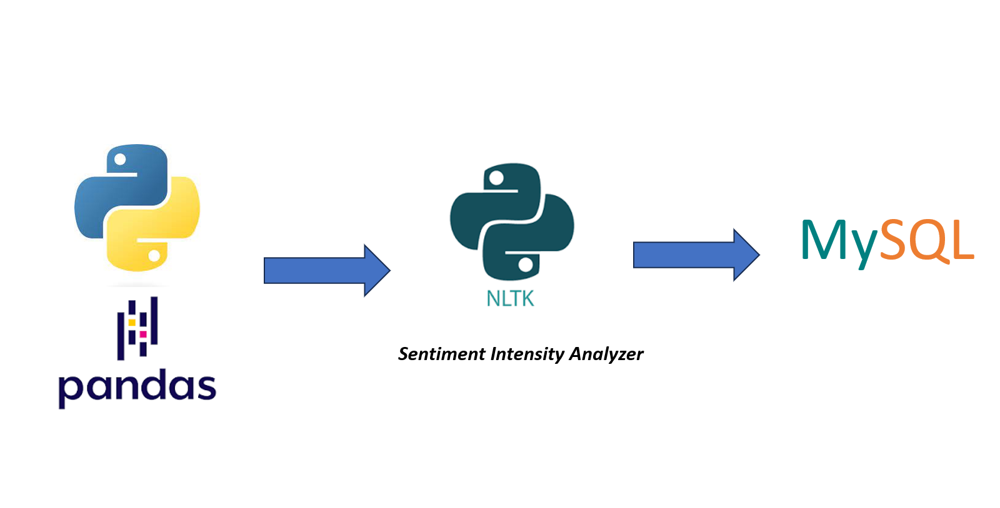

# E-commerce-Sentiment-Analysis-and-Review-Processing
Utilized a real-world e-commerce dataset to clean, analyze, and extract insights using various libraries of Python and SQL.

🚀 **Project Overview:**
Executed within the Hicounselor program (https://hicounselor.com/), this project showcases the application of data analysis and sentiment analysis skills to solve a real-world problem, leveraging a dataset graciously provided by Hicounselor.

🔍 **Project Goals:**
Embarking on a thorough exploration of an e-commerce platform using a rich dataset encompassing product details, brands, categories, customer reviews, and more. The ultimate goal? Uncover insightful revelations about customer patterns, trending products, seller efficacy, customer contentment, and holistic platform performance, employing an array of data analysis methods.

🛠️ **Technologies at Play:**
- **Python:** The analytical powerhouse for data manipulation and exploration.
- **Pandas:** A tool to efficiently handle and analyze data.
- **NLTK library:** Delving into the intricacies of natural language patterns within the dataset.
- **SQL:** Extracting valuable insights from data through querying, aggregating, joining, and analyzing datasets.

🌐 **Explore the Repository:**
Delve into the repository to engage with these tools firsthand. Have questions, thoughts, or feedback? Don't hesitate to reach out. Let's embark on this illuminating data exploration journey together!
